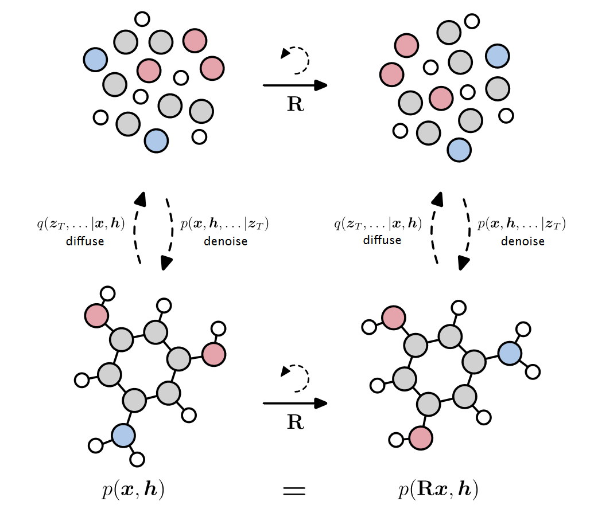

# Equivariant Diffusion for Molecule Generation in 3D

> Arxiv：[[2203.17003\] Equivariant Diffusion for Molecule Generation in 3D (arxiv.org)](https://arxiv.org/abs/2203.17003)  
> Author：[Emiel Hoogeboom](https://arxiv.org/search/cs?searchtype=author&query=Hoogeboom,+E), [Victor Garcia Satorras](https://arxiv.org/search/cs?searchtype=author&query=Satorras,+V+G), [Clément Vignac](https://arxiv.org/search/cs?searchtype=author&query=Vignac,+C), [Max Welling](https://arxiv.org/search/cs?searchtype=author&query=Welling,+M)          
> conference： ICML22
> subject：3D molecular generation
> method：E(3) Equivariant Diffusion Model (EDM) that operates on atom coordinates and categorical features, 
> evaluation：log-likelihood and molecule stability

EDM 学习对连续坐标和原子类别都起作用的逆扩散过程，该方法不需要特定的原子顺序

